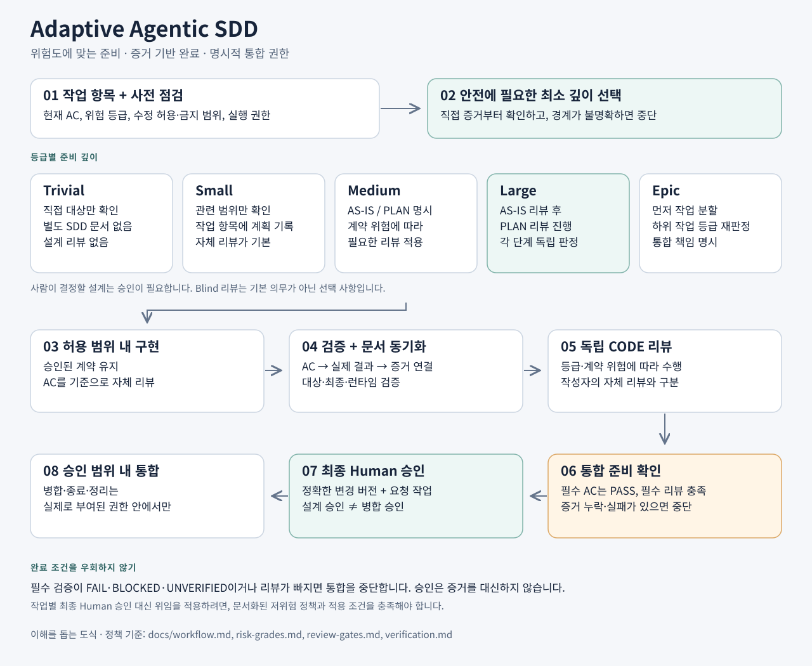

# Adaptive Agentic SDD — AI 코딩 에이전트를 위한 Adaptive SDD

[English](https://github.com/seok-jun/adaptive-agentic-sdd) | **한국어**

> 이 저장소는 영문 `adaptive-agentic-sdd`의 한국어판입니다. 영문을 기준 원문으로 사용하며, 한국어판은 정책의 의미와 필수·선택 조건을 유지해 현지화합니다.

> **SDD를 과도하게 키우지 않습니다.** 변경 위험이 커질 때만 계획·검토·검증의 깊이를 높입니다.

**작업 항목 우선 · 위험도 기반 게이트 · 점진적 공개 · 리비전 귀속 승인 · 증거 기반 완료**

Adaptive SDD는 **OpenAI Codex**, **Claude Code** 같은 **AI 코딩 에이전트(AI coding agents)**를 위한 위험 적응형 **Spec-Driven Development (SDD)** 워크플로입니다. 실무 **에이전틱 코딩(agentic coding)**에서 가장 작은 안전한 절차로 시작하고, 변경 위험이 커질 때만 분석·검토·검증을 강화하도록 설계했습니다.

Adaptive Agentic SDD는 관찰된 AS-IS 분석, 제한된 탐색, 위험 기반 검토, 리비전 귀속 승인, 증거 기반 완료를 결합합니다.

> 도구가 지원하는 최대한의 절차가 아니라, 비용이 큰 실수를 신뢰성 있게 막는 최소한의 절차를 적용합니다.

## 5분 빠른 시작

**새 CLI도, 특정 이슈 트래커도 필수가 아닙니다. 세 파일과 지금 쓰는 코딩 에이전트로 시작합니다.**

### 방법 A — 저장소를 에이전트에게 바로 전달

코딩 에이전트가 GitHub 저장소나 URL을 읽을 수 있다면 아래 프롬프트를 그대로 사용합니다.

```text
다음 저장소의 Adaptive SDD를 이 프로젝트에 도입해줘:
https://github.com/seok-jun/adaptive-agentic-sdd

starter는 그대로 복사하는 설정이 아니라 템플릿으로 사용해.
제품 코드를 수정하기 전에 현재 저장소를 분석하고 최소 도입안을 먼저 제안해.

starter를 다음과 같이 실제로 관찰한 저장소 정보에 맞춰 조정해:
- 프로젝트와 모듈 경계
- 실제 빌드 및 테스트 명령
- CI 기능
- 중요한 공유 또는 생성 경로
- 기존 개발 규칙

없는 기능이나 규칙을 만들어내지 마.
도입 구조는 최소한으로 유지하고 기존 저장소 지침은 보존해.
```

### 방법 B — 최소 starter 세 파일 복사

다음 세 파일을 대상 저장소에 복사한 뒤 프로젝트에 맞게 조정합니다.

```text
starter/AGENTS.md
  -> AGENTS.md

starter/.agents/skills/implementing-issue/SKILL.md
  -> .agents/skills/implementing-issue/SKILL.md

starter/docs/sdd-workflow.md
  -> docs/sdd-workflow.md
```

기존 파일이 있다면 덮어쓰지 말고 조정해서 합칩니다. starter의 placeholder는 대상 저장소에서 실제로 확인한 사실로만 교체합니다.

그다음 에이전트에게 이렇게 요청합니다.

```text
이 저장소를 분석하고 Adaptive SDD starter를 현재 프로젝트에 맞게 조정해줘.
아직 제품 코드는 수정하지 마.
도입 구조는 최소한으로 유지하고 기존 규칙을 보존한 뒤 변경안을 먼저 보여줘.
```

도입안이 확정되면 첫 실제 작업은 이 정도로 시작할 수 있습니다.

```text
이슈 #123을 Adaptive SDD로 구현해줘.
```

워크플로는 작게 시작하고 변경 위험이 커질 때만 분석·검토·검증을 강화합니다.

## 여기서 시작

- 워크플로 도입: [도입 가이드](docs/bootstrap.md)
- 일상 작업 실행: [개발자 가이드](docs/developer-guide.md)
- 기준 생명주기: [워크플로](docs/workflow.md)
- 등급 정의와 필요한 깊이: [위험 등급](docs/risk-grades.md)

## 워크플로 한눈에 보기

[](assets/workflow-overview-ko.svg)

**[상세 워크플로 도식 보기](assets/workflow-detailed-ko.svg)**

개요도는 이해를 돕는 자료이며 생명주기 계약을 대신하지 않습니다. 상세도는 Large의 AS-IS·PLAN 개별 검토, 증거 차단 조건, 선택적 Blind Audit, 최종 Human 허가를 보여줍니다. 둘 다 수정 가능한 SVG이며 [도식 관리](assets/README.md)에 범위를 설명합니다.

## v0.2 변경 내용

이식 가능한 실행 구조에 다음을 추가했습니다.

- 비동작 변경을 위한 Trivial fast-track
- 작은 루트 계약이 작업 Skill과 조건부 문서로 연결되는 점진적 공개
- 공개 공통 코어와 프로젝트 로컬 정책의 분리
- 단계와 리비전에 연결된 검토·승인
- starter 파일과 점진적 도입 경로

병합 전 보강에서는 이 원칙을 실제 실행 절차에 연결했습니다.

- Large의 AS-IS와 PLAN 검토 판정 분리
- 독립 검토와 선택적 Blind Audit 계약 명확화
- 인수 조건과 실제 검증 결과의 추적
- 설계 승인과 최종 통합 허가 분리
- 제한된 에이전트 인계와 리비전별 문맥 재사용
- 개발자 가이드와 갱신된 워크플로 도식

[제한 환경 검증 초안](docs/restricted-environment-verification.md)은 선택 사항이며 **구현되었거나 운영 검증을 마친 API·DB 자동화 기능이 아닙니다.**

## 핵심 원칙

1. **작업 항목 우선.** 현재 작업 항목이 목표, 범위, 인수 조건, 의존성, 확정된 결정을 정의합니다. 관리 도구는 바꿀 수 있습니다.
2. **관찰된 AS-IS.** 현재 메인라인 코드와 직접 런타임 증거가 현재 동작을 설명하며 오래된 계획은 그렇지 않습니다.
3. **정보 유형별 Source of Truth.** 요구사항, 동작, 아키텍처, 검증, 검토, 승인은 각각 다른 기준 출처를 가집니다. [기준 출처](docs/source-of-truth.md)를 참고하세요.
4. **위험에 맞춘 깊이.** 코딩 시간·파일 개수만이 아니라 위험, 가역성, 계약 영향, 실패 비용으로 등급을 결정합니다.
5. **점진적 공개.** 가장 작고 안정적인 진입 계약을 읽고 현재 단계에 관련 있는 Skill·문서만 추가합니다.
6. **구현 전 검증 설계.** 중요한 AC에는 입증 방법이 필요하며 실제 결과를 다시 AC에 연결해야 합니다.
7. **제한된 탐색.** 직접 경로, 심볼, 계약, 호출자·피호출자에서 시작하고 구체적 불확실성이 있을 때만 넓힙니다.
8. **검토는 재설계가 아니라 반증.** 자체 검토는 독립 검토가 아닙니다. Blind는 요구사항이 아니라 이전 판정을 먼저 제공하지 않는 방식입니다.
9. **리비전 귀속 승인.** 검토 PASS는 사람의 승인이 아니며 설계 승인은 최종 병합 허가가 아닙니다.
10. **증거 기반 완료.** 미실행 검사는 PASS가 아닙니다. 필수 검증·검토·허가와 해당하는 생명주기 작업이 실제로 완료되어야 합니다.

실제 트레이드오프를 기록하되 템플릿을 채우려고 대안을 만들지 않습니다. [트레이드오프 기록](docs/trade-off-capture.md)을 참고하세요.

## 이식 가능한 실행 구조

```text
AGENTS.md: 라우팅 + 항상 적용하는 보호 규칙
  -> 작업 Skill: 실행 절차
      -> 조건부 절차·도메인 문서
```

[starter](starter/AGENTS.md)는 도입 스냅샷이지 범용 복사·실행 설정이 아닙니다. placeholder를 바꾸고 로컬 정책을 조정하며 내부 계약의 일관성을 유지합니다. Skill 복사가 모든 방법론 문서의 복사까지 의미한다고 가정하지 않습니다.

## 공개 코어와 로컬 정책

작업 경계, 위험 분류, 제한된 탐색, 검증 대응, 리비전을 고려한 검토·승인, 증거 기반 완료는 이식 가능한 규칙으로 유지합니다.

모듈 이름, 환경 특이사항, 실제 명령, 조직별 승인 시스템, provider·모델 라우팅, 자격 증명, 업무 용어는 로컬에 둡니다. 모든 등급에 별도 SDD 파일, 독립 검토, Blind Audit을 강제하지 않습니다.

## 저장소 구조

```text
assets/       수정 가능한 개요·상세 워크플로 SVG
docs/         기준 정책, 도입 가이드, 개발자 가이드, 선택적 초안
starter/      간결한 루트 계약, 구현 Skill, 로컬 워크플로 계약
templates/    작업 항목, 설계, PR, QA, 리뷰 브리핑, 검증 인계
examples/     가상의 등급별 진행, 리뷰 동일성, 완료 증거 보존 예시
```

## 선택적 실무 자료

- [리뷰 대상 동일성](examples/review-identity/README.md): 스냅샷 포함 범위와 `identical / head-only / changed` 비교.
- [검증 인계](templates/verification-handoff.md): 계획한 기대값, 반환 관찰, 판정, 정정·재실행 이력. **DRAFT / OPTIONAL**을 유지합니다.
- [리뷰 브리핑](templates/review-briefing.md): 다섯 절 전체 양식과 지적 수정 후 축약 양식.
- [완료 증거](examples/completion-evidence/README.md): 설계·후보 증거 보존과 허가된 정리.

이 템플릿과 가상 예시는 기존 정책을 설명합니다. 운영 검증을 주장하거나 모든 작업에 추가 산출물을 요구하지 않습니다.

## 상태

**v0.2 — 이식 가능한 실무 방법론**

실용적인 워크플로이며 보편적 표준이나 모든 연동 기능이 구현되었다는 주장이 아닙니다. 건강한 워크플로는 실제 사용을 관찰하면서 더 작고 정교해집니다.
