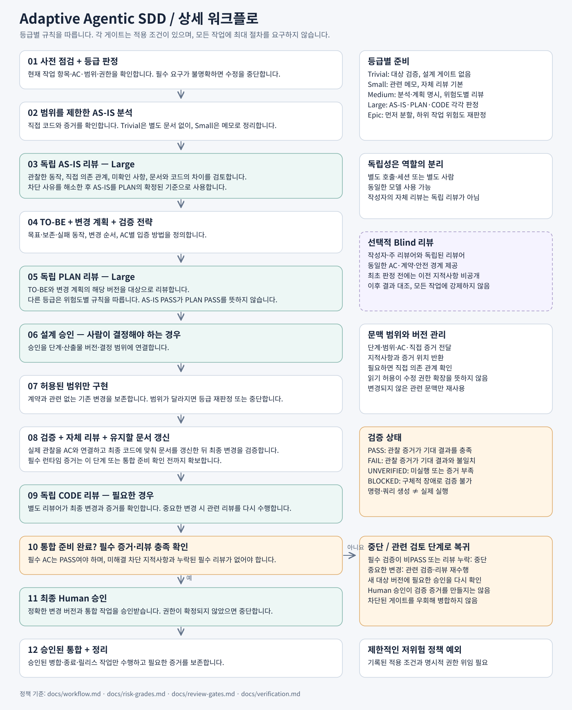
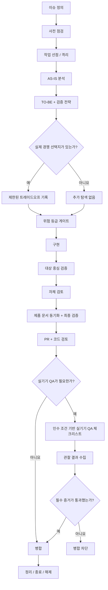

# Adaptive Agentic SDD

> 이 저장소는 [`adaptive-agentic-sdd`](https://github.com/seok-jun/adaptive-agentic-sdd)의 한국어판입니다.
> 영문 원본을 canonical source로 사용하며,
> 한국어판은 의미를 유지하면서 한국 개발 환경에 맞게 표현을 현지화합니다.

**이슈 우선 · 위험도 기반 적응형 · 검증 전략 · 조건부 실기기 QA · 제한된 탐색**



Adaptive Agentic SDD는 AI 코딩 에이전트를 활용할 때, 모든 변경에 무거운 절차를 강제하지 않으면서도 큰 비용이 드는 실수를 막을 만큼의 구조를 제공하는 실무 방법론입니다. 명세 주도 개발, 레거시 시스템의 AS-IS 분석, 위험도 기반 품질 게이트, 테스트·검증 계획, 아키텍처 거버넌스, 에이전트 오케스트레이션의 개념을 하나의 작업 흐름으로 결합합니다.

AI 에이전트는 빠르게 구현할 수 있지만, 요구사항을 잘못 해석하거나 범위를 벗어난 파일을 수정하고, 오래된 문서를 현재 동작으로 오인하거나, 저장소를 과도하게 탐색해 토큰과 컨텍스트를 낭비할 수 있습니다. Adaptive Agentic SDD는 작업을 이슈 중심으로 좁히고, 변경 위험에 맞는 깊이의 절차와 증거 기반 게이트를 적용해 이런 실패를 줄입니다.

Small, Medium, Large, Epic은 업무 중요도가 아니라 **변경 위험과 구현 범위**에 따라 구분합니다. 작은 변경에는 간결한 절차를, 실패 비용이나 영향 범위가 큰 변경에는 더 깊은 설계·검토·검증을 적용합니다. 모든 변경에 같은 절차를 적용하면 단순 작업의 비용만 커지고, 반대로 모든 변경을 가볍게 다루면 고위험 작업의 실패를 막기 어렵기 때문입니다.

토큰과 컨텍스트 비용도 엔지니어링 제약조건으로 봅니다. 더 많은 컨텍스트가 언제나 더 나은 결과를 만들지는 않으므로, 이슈와 직접 경로·심볼에서 시작해 구체적인 증거가 있을 때만 탐색 범위를 넓힙니다.

또한 이 방법론은 **Trade-off Discovery(트레이드오프 탐색)**가 아니라 **Trade-off Capture(트레이드오프 기록)**를 사용합니다. 문서를 채우기 위해 대안을 새로 발굴하지 않고, 제한된 분석 과정에서 실제 선택지가 발생했을 때만 선택과 비용을 기록합니다.

**Device QA(실기기 QA)는 모든 PR의 필수 절차가 아닙니다.** 단위 테스트나 에뮬레이터만으로 입증하기 어려운 실제 UI, 권한, 알림, 생명주기, 백그라운드 동작, 플랫폼 동작 등이 인수 조건에 포함될 때만 적용되는 조건부 Merge Gate입니다.

> 목표는 절차를 최대화하는 것이 아닙니다.
> 목표는 **비용이 큰 실수를 안정적으로 막는 최소한의 절차**를 적용하는 것입니다.

## 핵심 원칙

1. **이슈 우선(Issue-first)**
   현재 이슈가 목표, 범위, 경계, 의존성, 인수 조건을 규정하는 실행 명세입니다.

2. **관찰된 AS-IS(Observed AS-IS)**
   현재 동작은 과거 설계 문서가 아니라 현재 메인라인 코드에서 확인합니다.

3. **정보 유형별 Source of Truth(기준 출처)**
   모든 정보에 적용되는 하나의 보편적 권위는 없습니다. 요구사항, 현재 동작, 아키텍처, UI, 제품 규칙은 서로 다른 기준 출처를 가질 수 있습니다.

4. **위험도 기반 적응형 깊이(Risk-Adaptive Depth)**
   변경 위험에 따라 절차의 깊이를 조절합니다.

   | 등급 | 기본 깊이 |
   | --- | --- |
   | Small | 간결(Lean) |
   | Medium | 표준(Standard) |
   | Large | 심층(Deep) + 설계 검토 |
   | Epic | 작업 분할 + 심층 설계·검토 |

5. **구현 전 검증 전략(Verification Strategy)**
   중요한 각 인수 조건을 어떻게 입증할지 미리 정해야 합니다.

6. **트레이드오프 탐색이 아닌 트레이드오프 기록(Trade-off Capture)**
   문서를 채우려고 대안을 브레인스토밍하지 않습니다. 제한된 분석 중 실제로 서로 경쟁하는 선택지가 나타났을 때만 트레이드오프를 기록합니다.

7. **제한된 탐색(Bounded Exploration)**
   이슈, 직접 경로, 심볼, 공개 계약, 직접 호출자·피호출자에서 시작하고 구체적인 증거가 요구할 때만 범위를 넓힙니다.

8. **증거 기반 완료(Evidence-Based Completion)**
   테스트, CI, 검토, 실기기 QA는 판단의 증거입니다. 실행하지 않은 검증은 통과한 것이 아닙니다.

9. **작업 생명주기 완료(Lifecycle Completion)**
   최종 동작을 검증하고, 필요한 경우 지속 관리되는 제품 문서를 동기화하며, 임시 SDD 산출물을 제거하고, 작업 레인을 해제해야 작업이 끝납니다.

## 워크플로



## 위험 등급

### Small — 간결

변경이 하나의 구현 경계 안에 머물고 고위험 특성이 없을 때 사용합니다.

- 별도의 SDD 문서 묶음이 필요하지 않습니다.
- 이슈 본문을 변경 계획으로 사용할 수 있습니다.
- 대상 중심 검증을 수행합니다.
- 자체 검토를 수행합니다.

### Medium — 표준

여러 구현 경계나 공유 계약이 관련되지만 고위험 변경은 아닐 때 사용합니다.

- AS-IS, TO-BE, 변경 계획을 작성합니다.
- 검증 전략을 수립합니다.
- 유용한 경우 제한된 검토를 수행합니다.
- 저장소 전체를 의무적으로 다시 탐색하지 않습니다.

### Large — 심층

보안·개인정보, 스키마 마이그레이션, 재시도·스케줄링 정책, 비용·쿼터 집행 등 실패 비용이 큰 변경에 사용합니다.

- AS-IS 게이트를 적용합니다.
- TO-BE·변경 계획 게이트를 적용합니다.
- 구현 전에 설계 검토를 수행합니다.
- 병합 전에 독립 코드 검토를 수행합니다.
- 더 넓은 범위의 검증을 수행합니다.

### Epic — 먼저 분할

모듈 경계를 변경하거나 새 모듈을 만들거나, 독립적으로 전달할 수 있는 여러 기능을 포함할 때 사용합니다.

- 먼저 작업을 분할합니다.
- 통합 책임을 정의합니다.
- 관련 구현 레인에는 Large 수준의 엄격성을 적용합니다.

## 토큰·컨텍스트 효율

Adaptive Agentic SDD는 “컨텍스트가 많을수록 언제나 좋다”고 가정하지 않습니다.

기본 원칙:

- 관련 없는 이슈나 도메인을 읽지 않습니다.
- 직접 경로·심볼에서 시작합니다.
- 같은 실행 안에서는 변경되지 않은 컨텍스트를 재사용합니다.
- 이슈에서 이미 확정한 요구사항을 다시 탐색하지 않습니다.
- 광범위한 검사보다 대상 중심 검사를 먼저 실행합니다.
- 검토·QA 에이전트에게 제품을 다시 설계하도록 요구하지 않습니다.
- 트레이드오프 문서를 위해 저장소 전체에서 대안을 탐색하지 않습니다.

의도한 추론 예산은 위험도에 따라 달라집니다.

```text
Small  -> 간결
Medium -> 표준
Large  -> 심층
Epic   -> 작업 분할 + 심층 + 독립 검토
```

## 저장소 구조

```text
adaptive-agentic-sdd-ko/
├── README.md
├── assets/
│   └── workflow-ko.svg
├── docs/
│   ├── concepts.md
│   ├── workflow.md
│   ├── source-of-truth.md
│   ├── risk-grades.md
│   ├── verification.md
│   ├── review-gates.md
│   ├── device-qa.md
│   ├── token-efficiency.md
│   └── trade-off-capture.md
├── templates/
│   ├── issue.md
│   ├── as-is.md
│   ├── to-be.md
│   ├── change-plan.md
│   ├── pull-request.md
│   └── device-qa.md
└── examples/
    ├── small/
    ├── medium/
    └── large/
```

## 상태

**v0.1 — 실무 적용 중인 방법론(Working Methodology)**

이 방법론은 보편적 표준이 아니라 실용적인 워크플로로 제시됩니다. 실제 실패를 막지 못하는 게이트를 제거하는 것 역시 운영의 중요한 일부입니다.

건강한 워크플로는 시간이 지날수록 규칙을 끝없이 쌓는 것이 아니라 **더 작고 정교해져야 합니다**.
