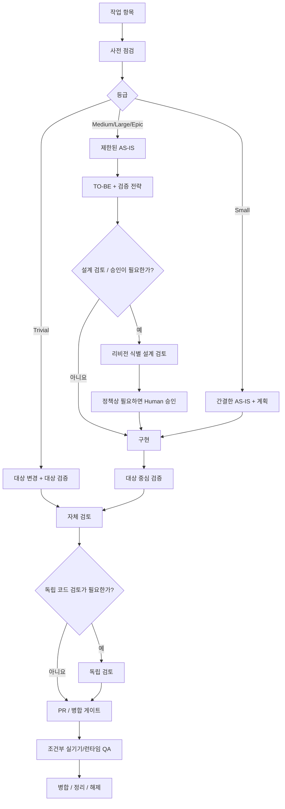

# Adaptive Agentic SDD

> 이 저장소는 [`adaptive-agentic-sdd`](https://github.com/seok-jun/adaptive-agentic-sdd)의 한국어판입니다.
> 영문 원본을 canonical source로 사용하며,
> 한국어판은 의미를 유지하면서 한국 개발 환경에 맞게 표현을 현지화합니다.

**작업 항목 우선 · 위험도 기반 게이트 · 점진적 공개 · 리비전 귀속 승인 · 증거 기반 완료**

Adaptive Agentic SDD는 AI 코딩 에이전트를 활용할 때 모든 변경에 무거운 절차를 강제하지 않으면서도, 큰 비용이 드는 실수를 막을 만큼의 구조를 제공하는 실무 워크플로입니다.

이 방법론은 명세 주도 개발, 관찰 기반 레거시 시스템 분석, 위험도 기반 품질 게이트, 검증 계획, 제한된 에이전트 탐색, 검토 provenance, 작업 생명주기 완료를 결합합니다.

> 목표는 절차를 최대화하는 것이 아닙니다.  
> 목표는 **비용이 큰 실수를 안정적으로 막는 최소한의 절차**를 적용하는 것입니다.

## v0.2에서 바뀐 점

v0.2는 기존 방법론의 핵심을 유지하면서, 실제 저장소를 반복 운영하며 얻은 경험을 바탕으로 이식 가능한 agent-runtime 계층을 추가합니다.

- 비동작 변경을 위한 **Trivial** fast-track 등급,
- **점진적 공개(Progressive Disclosure)**: 작은 루트 지침이 작업별 Skill로 라우팅하고, Skill이 필요한 상세 정책만 조건부로 읽는 구조,
- **portable workflow 규칙**과 **프로젝트 로컬 safeguard**의 명시적 분리,
- 저장소 전체를 다시 탐색하지 않는 phase-aware Review Packet,
- review finding을 Human Decision, 실행 계약, 구현, non-blocking 유형으로 분리,
- **리비전 귀속 Human 승인**: Review PASS와 승인을 구분하고, 승인을 phase·artifact revision·decision scope에 묶음,
- 성숙한 프로젝트의 모든 게이트를 복사하지 않고 기존 저장소에 점진적으로 도입하는 bootstrap 경로,
- `starter/` 아래 바로 수정해 사용할 수 있는 `AGENTS.md`와 구현 Skill 예시.

## 핵심 원칙

1. **작업 항목 우선(Work-item-first)**  
   현재 작업 항목(GitHub Issue, Jira 티켓 또는 동등한 시스템)이 목표, 범위, 경계, 의존성, 인수 조건을 규정하는 실행 명세입니다.

2. **관찰된 AS-IS(Observed AS-IS)**  
   현재 동작은 오래된 설계 문구가 아니라 현재 메인라인 코드와 직접 런타임 증거에서 확인합니다.

3. **정보 유형별 Source of Truth(기준 출처)**  
   요구사항, 현재 동작, 아키텍처, UI, 제품 규칙은 서로 다른 권위 있는 출처를 가질 수 있습니다.

4. **위험도 기반 적응형 깊이(Risk-Adaptive Depth)**  
   티켓 크기만이 아니라 변경 위험에 따라 절차의 깊이를 조절합니다.

   | 등급 | 기본 깊이 |
   | --- | --- |
   | Trivial | Fast-track |
   | Small | 간결(Lean) |
   | Medium | 표준(Standard) |
   | Large | 심층(Deep) + 독립 설계 검토 |
   | Epic | 작업 분할 + 고위험 레인 심층 검토 |

5. **점진적 공개(Progressive Disclosure)**  
   에이전트는 가장 작고 안정적인 진입 계약부터 읽고, 현재 작업에 필요한 경우에만 작업별 Skill과 상세 process/domain 문서를 추가로 읽습니다.

6. **구현 전 검증 전략(Verification Strategy)**  
   중요한 인수 조건은 코드를 변경하기 전에 어떻게 입증할지 알고 있어야 합니다.

7. **제한된 탐색(Bounded Exploration)**  
   작업 항목, 직접 경로·심볼, 공개 계약, 직접 호출자·피호출자에서 시작하고 증거가 요구할 때만 탐색 범위를 넓힙니다.

8. **검토는 재설계가 아니라 반증(Review is falsification, not redesign)**  
   검토자는 제안된 변경이 틀렸거나, 안전하지 않거나, 일관되지 않거나, 검증 불가능한 구체적 이유를 찾는 데 집중합니다.

9. **리비전 귀속 Human 승인(Revision-bound Human approval)**  
   Human 승인이 필요할 때는 Human에게 실제로 제시한 정확한 phase, artifact revision, decision scope에 승인을 묶습니다. 의미 있는 변경이 생기면 새로운 검토·승인이 필요합니다.

10. **증거 기반 생명주기 완료(Evidence-based lifecycle completion)**  
    실행하지 않은 검사는 PASS가 아닙니다. 필수 검증, 검토, 지속 문서 동기화, 병합·정리, 레인 해제가 실제로 끝나야 작업이 완료됩니다.

## 워크플로



canonical 생명주기는 [docs/workflow.md](docs/workflow.md)를 참고하세요.

## Portable runtime 구조

성숙한 저장소라고 해서 모든 workflow 규칙을 `AGENTS.md`에 넣을 필요는 없습니다.

```text
AGENTS.md
   -> 작업 라우팅 + 항상 적용 hard guard
        -> 작업 Skill
             -> 조건부 process/domain 문서
```

이 구조는 초기 컨텍스트를 작게 유지하면서도 필요한 규칙으로 들어가는 경로를 끊지 않습니다.

`starter/` 디렉터리는 기존 저장소에 맞게 조정할 수 있는 의도적으로 작은 예시입니다. 범용 drop-in 설정이 아닙니다. placeholder를 바꾸고, 불필요한 guard는 제거하고, 프로젝트가 실제로 필요성을 보여준 로컬 규칙만 추가하세요.

## 도입 경로

기존 프로젝트에 적용할 때는 [docs/bootstrap.md](docs/bootstrap.md)부터 시작합니다.

1. workflow를 바꾸기 전에 저장소를 관찰합니다.
2. 간결한 루트 agent contract를 만듭니다.
3. 구현 Skill 하나만 추가합니다.
4. 위험 등급과 검증 기대치를 정의합니다.
5. Trivial/Small 실제 작업으로 파일럿합니다.
6. 실패 비용이 정당화할 때만 깊은 검토·승인 게이트를 추가합니다.

## 저장소 구조

```text
adaptive-agentic-sdd-ko/
├─ README.md
├─ docs/
│  ├─ bootstrap.md
│  ├─ concepts.md
│  ├─ workflow.md
│  ├─ source-of-truth.md
│  ├─ risk-grades.md
│  ├─ verification.md
│  ├─ review-gates.md
│  ├─ device-qa.md
│  ├─ token-efficiency.md
│  └─ trade-off-capture.md
├─ starter/
│  ├─ AGENTS.md
│  ├─ .agents/skills/implementing-issue/SKILL.md
│  └─ docs/sdd-workflow.md
├─ templates/
└─ examples/
```

## Portable core와 프로젝트 로컬 정책

일반적으로 portable core에 둘 것:

- 작업 항목 우선 실행,
- 위험 등급,
- 제한된 탐색,
- 점진적 공개,
- 검증 매핑,
- 리비전 인식 검토·승인,
- 증거 기반 완료.

프로젝트 간 일반화되기 전까지 로컬에 둘 것:

- 모듈 이름과 수정 금지 경로,
- 빌드 도구 특이사항,
- 실기기·에뮬레이터 설정,
- shell·encoding workaround,
- 제품 전용 용어,
- provider별 secret/media 규칙,
- 모델/provider qualification matrix.

## 상태

**v0.2 — 이식 가능한 실무 방법론(Portable Working Methodology)**

이 방법론은 보편적 표준이 아니라 실용적인 워크플로입니다. 건강한 워크플로는 시간이 지날수록 규칙을 끝없이 쌓는 것이 아니라 **더 작고 정교해져야 합니다**.
